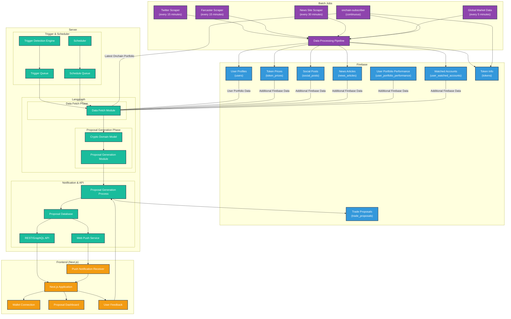

# Daiko AI MVP Monorepo

## 概要

Daiko AIは、暗号資産トレーダーのためのAIパワードトレーディングアシスタントです。ソーシャルメディア、ニュース、オンチェーンデータを統合し、高度な分析と取引提案を提供します。

## 主な機能

- リアルタイムのマーケットデータ監視
- ソーシャルメディア（Twitter、Farcaster）の感情分析
- ニュースサイトからの情報収集
- オンチェーンデータの分析
- AIによる取引提案生成
- ユーザーポートフォリオのパフォーマンス追跡

## 技術スタック

- **フロントエンド**: Next.js
- **バックエンド**: Python (FastAPI)
- **データベース**: Firebase
- **AI/ML**: LangGraph
- **インフラ**: Cloud Run, Cloud Functions

## セットアップ手順

### 前提条件

- Node.js 18以上
- Python 3.10以上
- Firebase CLIツール
- Google Cloud SDKツール

### 開発環境のセットアップ

1. リポジトリのクローン

```bash
git clone https://github.com/your-org/daiko-ai-mvp-monorepo.git
cd daiko-ai-mvp-monorepo
```

2. 環境変数の設定

```bash
cp .env.example .env
# .envファイルを編集して必要な環境変数を設定
```

3. フロントエンドのセットアップ

```bash
cd frontend
npm install
npm run dev
```

4. バックエンドのセットアップ

```bash
cd backend
python -m venv venv
source venv/bin/activate  # Windows: venv\Scripts\activate
pip install -r requirements.txt
uvicorn main:app --reload
```

## アーキテクチャ



## プロジェクト構成

```bash
.
├── README.md
├── apps
│   └── web
├── package.json
├── packages
│   ├── news-scraper
│   ├── shared
│   └── x-scraper
├── pnpm-lock.yaml
├── pnpm-workspace.yaml
├── scripts
│   └── clean-packages.sh
└── turbo.json
```
