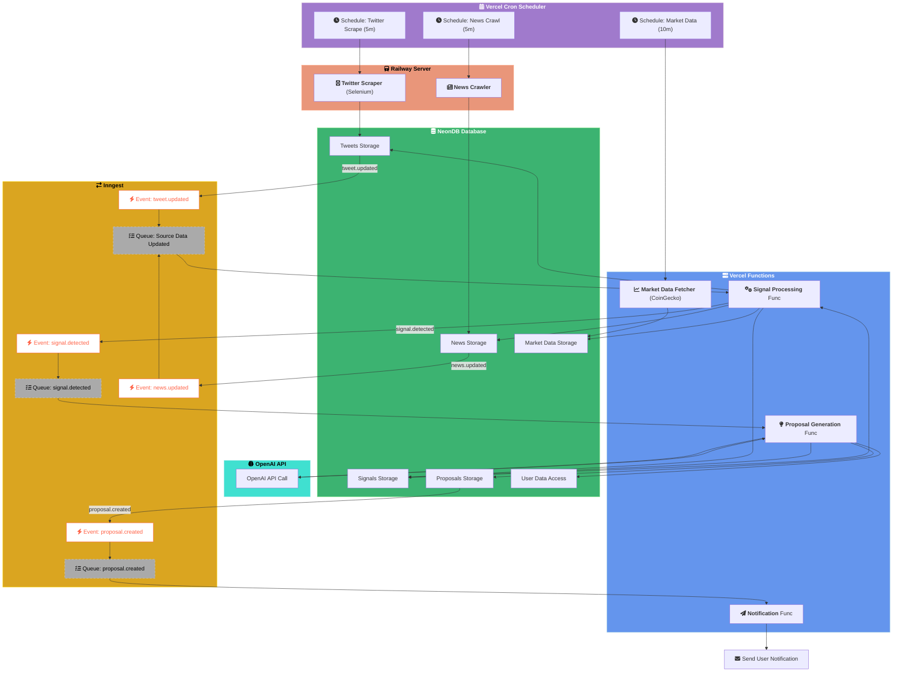

# バックエンド仕様書

## アーキテクチャ



## Vercel Cron Schedulers

### 目的

定期的なバッチ処理（データ収集）をトリガーします。

### 詳細

| ジョブ名           | スケジュール | ターゲット                                     | 目的                                         |
| :----------------- | :----------- | :--------------------------------------------- | :------------------------------------------- |
| Twitter Scrape Job | 5分ごと      | Railway: Twitter Scraper Service               | 定期的にTwitterから関連ツイートを取得する    |
| News Crawl Job     | 5分ごと      | Railway: News Crawler Service                  | 定期的に主要ニュースサイトから記事を取得する |
| Market Data Job    | 10分ごと     | Vercel Functions: Market Data Fetcher Function | 主要トークンの市場価格データを取得・更新する |

### 実装

- VercelのCron Job機能 (`vercel.json`) を使用して設定します。
- 各ジョブは対応するサービスのHTTPエンドポイントを呼び出すか、特定のイベントを発行して処理を開始させます。

---

## Railway Services (Data Acquisition)

### 1. Twitter Scraper Service

#### 目的

Vercel Cronからのトリガーを受け、Selenium Gridを使用してTwitterから特定のキーワードやアカウントに関連するツイートを取得し、NeonDBに保存します。

#### トリガー

- Vercel Cron (5分ごと) によるHTTPリクエスト or イベント

#### 技術スタック

- Node.js / TypeScript
- Selenium WebDriver (or Playwright)
- `pnpm` (Monorepo管理)
- NeonDB (`drizzle-orm`)

#### 処理フロー

1. Cronからのトリガーを受け取る。
2. 設定されたキーワードやアカウントリストに基づき、検索クエリを生成する。
3. Selenium Grid (Railway上の別サービス or 外部サービス) を利用してTwitterにアクセスし、検索を実行する。
4. 取得したツイートデータ（本文、投稿者、投稿日時、エンゲージメント数など）を整形する。
5. `drizzle-orm` を使用して、NeonDBの `tweets` テーブルに新しいツイートを挿入する (重複は避ける)。
6. 処理完了後、Inngestに `tweet.updated` イベントを送信する。

#### データスキーマ (NeonDB: `tweets`)

```typescript
// packages/shared/src/schema/tweets.ts (仮)
import { pgTable, serial, text, timestamp, integer } from "drizzle-orm/pg-core";

export const tweets = pgTable("tweets", {
  id: serial("id").primaryKey(),
  tweetId: text("tweet_id").notNull().unique(), // TwitterのTweet ID
  authorId: text("author_id"),
  text: text("text").notNull(),
  postedAt: timestamp("posted_at").notNull(),
  source: text("source").default("twitter"), // データソース
  likes: integer("likes").default(0),
  retweets: integer("retweets").default(0),
  // ... その他必要なメタデータ
  createdAt: timestamp("created_at").defaultNow(),
});
```

#### エラーハンドリング

- Selenium操作中のエラー（要素が見つからない、ログイン失敗など）を捕捉し、リトライ処理やログ記録を行う。
- DB保存時のエラー（接続エラー、一意制約違反など）を適切に処理する。

### 2. News Crawler Service

#### 目的

Vercel Cronからのトリガーを受け、指定されたニュースサイトをクロールし、新しい記事を取得してNeonDBに保存します。

#### トリガー

- Vercel Cron (5分ごと) によるHTTPリクエスト or イベント

#### 技術スタック

- Node.js / TypeScript
- HTTP Client (e.g., `axios`, `node-fetch`)
- HTML Parser (e.g., `cheerio`)
- `pnpm` (Monorepo管理)
- NeonDB (`drizzle-orm`)

#### 処理フロー

1. Cronからのトリガーを受け取る。
2. 設定されたニュースサイトのURLリストを読み込む。
3. 各サイトにHTTPリクエストを送信し、HTMLコンテンツを取得する。
4. `cheerio` 等を使用してHTMLをパースし、記事のタイトル、URL、本文（要約）、公開日時などを抽出する。
5. 抽出した記事データを整形する。
6. `drizzle-orm` を使用して、NeonDBの `news` テーブルに新しい記事を挿入する (重複は避ける)。
7. 処理完了後、Inngestに `news.updated` イベントを送信する。

#### データスキーマ (NeonDB: `news`)

```typescript
// packages/shared/src/schema/news.ts (仮)
import { pgTable, serial, text, timestamp } from "drizzle-orm/pg-core";

export const news = pgTable("news", {
  id: serial("id").primaryKey(),
  articleId: text("article_id").unique(), // サイト固有ID or URLハッシュなど
  title: text("title").notNull(),
  url: text("url").notNull().unique(),
  sourceName: text("source_name"), // 例: "CoinDesk", "Bloomberg"
  publishedAt: timestamp("published_at"),
  summary: text("summary"), // 記事の要約 or 本文の一部
  // ... その他カテゴリ等のメタデータ
  createdAt: timestamp("created_at").defaultNow(),
});
```

#### エラーハンドリング

- HTTPリクエストのエラー（タイムアウト、404/500エラーなど）を捕捉し、リトライやログ記録を行う。
- HTMLパース時のエラー（構造変更による要素取得失敗など）を適切に処理する。
- DB保存時のエラーを処理する。

---

## Vercel Functions (Data Acquisition)

### Market Data Fetcher Function

#### 目的

Vercel Cronからのトリガーを受け、CoinGecko APIなどから主要な仮想通貨の市場価格データを取得し、NeonDBに保存・更新します。

#### トリガー

- Vercel Cron (10分ごと)

#### 技術スタック

- Node.js / TypeScript (Vercel Serverless Function)
- HTTP Client (e.g., `axios`, `node-fetch`)
- `pnpm` (Monorepo管理)
- NeonDB (`drizzle-orm`)

#### 処理フロー

1. Cronからのトリガーを受け取る。
2. 監視対象のトークンリスト（例: BTC, ETH, SOL...）を定義またはDBから取得する。
3. CoinGecko API (または他のデータソース)のエンドポイントを呼び出し、対象トークンの最新価格、出来高、時価総額などを取得する。
4. 取得したデータを整形する。
5. `drizzle-orm` を使用して、NeonDBの `market_data` テーブルに価格情報を挿入または更新する (`UPSERT` 処理)。
6. (オプション) Inngestに `market_data.updated` イベントを送信することも可能（シグナル検出でリアルタイム性が必要な場合）。

#### データスキーマ (NeonDB: `market_data`)

```typescript
// packages/shared/src/schema/market_data.ts (仮)
import { pgTable, serial, text, timestamp, decimal } from "drizzle-orm/pg-core";

export const marketData = pgTable("market_data", {
  id: serial("id").primaryKey(),
  tokenId: text("token_id").notNull(), // 例: "bitcoin", "ethereum" (CoinGecko IDなど)
  symbol: text("symbol").notNull(), // 例: "BTC", "ETH"
  priceUsd: decimal("price_usd", { precision: 18, scale: 8 }).notNull(), // 米ドル価格
  volume24h: decimal("volume_24h", { precision: 24, scale: 4 }), // 24時間出来高
  marketCap: decimal("market_cap", { precision: 24, scale: 4 }), // 時価総額
  timestamp: timestamp("timestamp").notNull(), // データ取得時点のタイムスタンプ
  // ... その他、変動率など
  createdAt: timestamp("created_at").defaultNow(),
});
// tokenIdとtimestampで複合ユニーク制約やインデックスを検討
```

#### エラーハンドリング

- API呼び出し時のエラー（レートリミット、APIキーエラー、ネットワークエラーなど）を捕捉し、リトライやログ記録を行う。
- データ整形時のエラー（予期しないレスポンス形式など）を処理する。
- DB保存/更新時のエラーを処理する。
