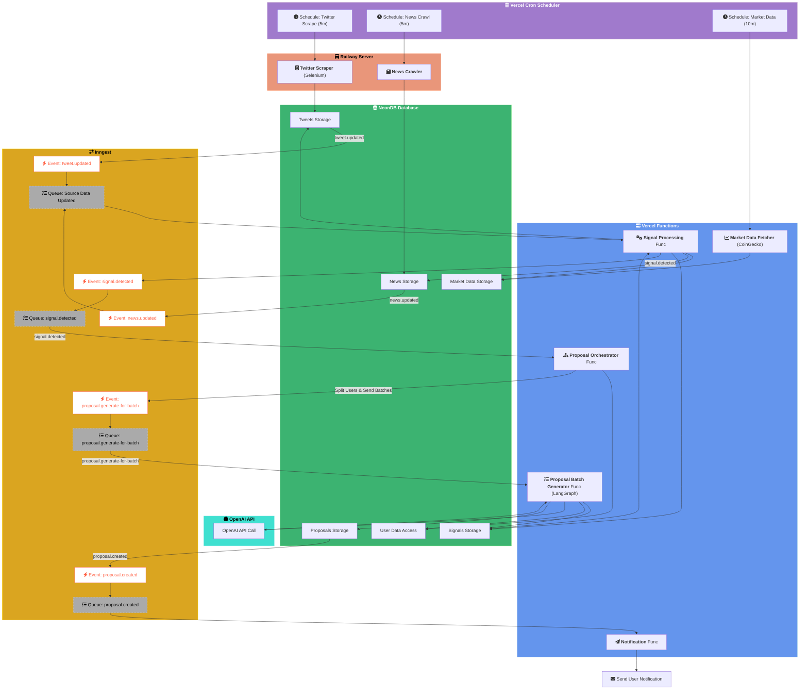

# バックエンド仕様書

## アーキテクチャ

## Vercel Cron Schedulers

### 目的

定期的なバッチ処理（データ収集）をトリガーします。

### 詳細

| ジョブ名           | スケジュール | ターゲット                                     | 目的                                         |
| :----------------- | :----------- | :--------------------------------------------- | :------------------------------------------- |
| Twitter Scrape Job | 5分ごと      | Railway: Twitter Scraper Service               | 定期的にTwitterから関連ツイートを取得する    |
| News Crawl Job     | 5分ごと      | Railway: News Crawler Service                  | 定期的に主要ニュースサイトから記事を取得する |
| Market Data Job    | 10分ごと     | Vercel Functions: Market Data Fetcher Function | 主要トークンの市場価格データを取得・更新する |

### 実装

- VercelのCron Job機能 (`vercel.json`) を使用して設定します。
- 各ジョブは対応するサービスのHTTPエンドポイントを呼び出すか、特定のイベントを発行して処理を開始させます。

---

## Railway Services (Data Acquisition)

### 1. Twitter Scraper Service

#### 目的

Vercel Cronからのトリガーを受け、Selenium Gridを使用してTwitterから特定のキーワードやアカウントに関連するツイートを取得し、NeonDBに保存します。

#### トリガー

- Vercel Cron (5分ごと) によるHTTPリクエスト or イベント

#### 技術スタック

- Node.js / TypeScript
- Selenium WebDriver (or Playwright)
- `pnpm` (Monorepo管理)
- NeonDB (`drizzle-orm`)

#### 処理フロー

1. Cronからのトリガーを受け取る。
2. 設定されたキーワードやアカウントリストに基づき、検索クエリを生成する。
3. Selenium Grid (Railway上の別サービス or 外部サービス) を利用してTwitterにアクセスし、検索を実行する。
4. 取得したツイートデータ（本文、投稿者、投稿日時、エンゲージメント数など）を整形する。
5. `drizzle-orm` を使用して、NeonDBの `tweets` テーブルに新しいツイートを挿入する (重複は避ける)。
6. 処理完了後、Inngestに `tweet.updated` イベントを送信する。

#### データスキーマ (NeonDB: `tweets`)

※詳細なテーブル定義は `packages/shared/src/schema` 以下の `tweets.ts` を参照してください。

#### エラーハンドリング

- Selenium操作中のエラー（要素が見つからない、ログイン失敗など）を捕捉し、リトライ処理やログ記録を行う。
- DB保存時のエラー（接続エラー、一意制約違反など）を適切に処理する。

### 2. News Crawler Service

#### 目的

Vercel Cronからのトリガーを受け、指定されたニュースサイトをクロールし、新しい記事を取得してNeonDBに保存します。

#### トリガー

- Vercel Cron (5分ごと) によるHTTPリクエスト or イベント

#### 技術スタック

- Node.js / TypeScript
- HTTP Client (e.g., `axios`, `node-fetch`)
- HTML Parser (e.g., `cheerio`)
- `pnpm` (Monorepo管理)
- NeonDB (`drizzle-orm`)

#### 処理フロー

1. Cronからのトリガーを受け取る。
2. 設定されたニュースサイトのURLリストを読み込む。
3. 各サイトにHTTPリクエストを送信し、HTMLコンテンツを取得する。
4. `cheerio` 等を使用してHTMLをパースし、記事のタイトル、URL、本文（要約）、公開日時などを抽出する。
5. 抽出した記事データを整形する。
6. `drizzle-orm` を使用して、NeonDBの `news` テーブルに新しい記事を挿入する (重複は避ける)。
7. 処理完了後、Inngestに `news.updated` イベントを送信する。

#### データスキーマ (NeonDB: `news`)

※詳細なテーブル定義は `packages/shared/src/schema` 以下の `news.ts` を参照してください。

#### エラーハンドリング

- HTTPリクエストのエラー（タイムアウト、404/500エラーなど）を捕捉し、リトライやログ記録を行う。
- HTMLパース時のエラー（構造変更による要素取得失敗など）を適切に処理する。
- DB保存時のエラーを処理する。

---

## Inngest とは？

### 役割

- 実行ランタイムではなく **イベント駆動ワークフロー＆ジョブキュー SaaS**
- Inngest Cloud はイベント管理とリトライ・スケジューリングを担い、実際のコードは Next.js／Vercel Functions など既存ランタイムで実行される

### 採用メリット

| 機能カテゴリ     | Inngest が担保                                     | 自前実装した場合                    |
| ---------------- | -------------------------------------------------- | ----------------------------------- |
| 配信保証         | at-least-once 配信、指数バックオフ付き自動リトライ | LISTEN/NOTIFY + 手動リトライ実装    |
| 冪等性           | `step.idempotencyKey()` 1 行で重複排除             | DB ユニーク制約＋排他ロック         |
| 並列度制御       | `concurrency.limit` で簡単設定                     | Redis レートリミタ等を構築          |
| 可観測性         | Web ダッシュボードでイベント／ステップを視覚化     | CloudWatch / Grafana などを別途構築 |
| スケジューリング | `inngest.cron()` でコード内に Cron 設定            | 外部 Cron + HTTP 呼び出し           |

### 実装フロー (Next.js の例)

1. クリティカルパス終了後に `inngest.send({ name: "tweet.updated", data: {...} })` を呼ぶ
2. `inngest.createFunction({ id: "detect-signal" }, { event: "tweet.updated" }, async ({ event }) => { ... })` でハンドラを定義
3. `serve()` を API Route (`/api/inngest`) に配置 → Inngest Cloud が署名付き HTTP で呼び出す

### 採用判断の指針

- ステップが複数、外部 API 失敗が多い、並列制御が必要など **複雑化が見込まれる場合** → Inngest を採用
- 少量トラフィックで単発処理のみの場合 → Phase1: LISTEN/NOTIFY + 単一 Worker で開始し、負荷増大時に Inngest へ移行

> 詳細な背景や判断基準は README も参照してください。

---

## Vercel Functions (Data Acquisition)

### Market Data Fetcher Function

#### 目的

Vercel Cronからのトリガーを受け、CoinGecko APIなどから主要な仮想通貨の市場価格データを取得し、NeonDBに保存・更新します。

#### トリガー

- Vercel Cron (10分ごと)

#### 技術スタック

- Node.js / TypeScript (Vercel Serverless Function)
- HTTP Client (e.g., `axios`, `node-fetch`)
- `pnpm` (Monorepo管理)
- NeonDB (`drizzle-orm`)

#### 処理フロー

1. Cronからのトリガーを受け取る。
2. 監視対象のトークンリスト（例: BTC, ETH, SOL...）を定義またはDBから取得する。
3. CoinGecko API (または他のデータソース)のエンドポイントを呼び出し、対象トークンの最新価格、出来高、時価総額などを取得する。
4. 取得したデータを整形する。
5. `drizzle-orm` を使用して、NeonDBの `market_data` テーブルに価格情報を挿入または更新する (`UPSERT` 処理)。
6. (オプション) Inngestに `market_data.updated` イベントを送信することも可能（シグナル検出でリアルタイム性が必要な場合）。

#### データスキーマ (NeonDB: `market_data`)

※詳細なテーブル定義は `packages/shared/src/schema` 以下の `market_data.ts` を参照してください。

#### エラーハンドリング

- API呼び出し時のエラー（レートリミット、APIキーエラー、ネットワークエラーなど）を捕捉し、リトライやログ記録を行う。
- データ整形時のエラー（予期しないレスポンス形式など）を処理する。
- DB保存/更新時のエラーを処理する。

---

## Vercel Functions & Inngest Workflows (Processing & Generation)

### Signal Processing Function (`H_SignalProcessingFunc`)

#### 目的

Inngest の `Source Data Updated` キュー (`ING_SignalDataQueue`) からイベント (例: `tweet.updated`, `news.updated`) を受け取り、関連データ (ツイート、ニュース、市場データ) を分析して取引シグナルを検出し、DBに保存します。

#### トリガー

- Inngest イベント (`tweet.updated`, `news.updated`, etc. via `ING_SignalDataQueue`)

#### 技術スタック

- Vercel Function (TypeScript)
- NeonDB (`drizzle-orm`)
- Inngest SDK

#### 処理フロー

1. Inngest からデータ更新イベントを受け取る。
2. `step.run` を使用して、イベントデータ (例: `xId`) に関連する最新のツイート、ニュース記事、および関連する市場データをDBから取得する。
3. 取得したデータを分析し、事前に定義されたロジック（キーワード照合、センチメント分析、テクニカル指標など）に基づいてシグナルを検出する。
4. 検出された場合:
   - シグナルの詳細 (タイプ、強度、関連資産、トリガーデータなど) を整形する。
   - `drizzle-orm` を使用して `signals` テーブルにシグナルを保存する。
   - `inngest.send` を使用して `processing/signal.detected` イベントを `signalId` と共に Inngest に送信する。
5. 検出されなかった場合は、処理を終了する。

#### データスキーマ (NeonDB: `signals`)

※ `packages/shared/src/db/schema/signals.ts` を参照。

#### エラーハンドリング

- データ取得、シグナル検出ロジック、DB保存、Inngest イベント送信中のエラーを捕捉し、Inngest のリトライ機構を活用する。

### Proposal Orchestrator Function (`O_ProposalOrchestratorFunc`)

#### 目的

`processing/signal.detected` イベントを受け取り、該当シグナルに関連する全ユーザーを特定し、提案生成処理を小さなバッチに分割して Inngest 経由で後続の関数に依頼します。これにより、Vercel の実行時間制限を回避します。

#### トリガー

- Inngest イベント (`processing/signal.detected` via `ING_ProposalQueue`)

#### 技術スタック

- Vercel Function (TypeScript)
- NeonDB (`drizzle-orm`)
- Inngest SDK

#### 処理フロー

1. Inngest から `processing/signal.detected` イベントを `signalId` と共に受け取る。
2. `step.run` を使用して、`signalId` に基づいて `signals` テーブルからシグナルの詳細 (特に `tokenAddress` や `relatedTokens`) を取得する。
3. `step.run` を使用して、シグナルに関連する資産をポートフォリオに持つ**全ての**ユーザーIDを `user_portfolios` (または関連テーブル) から取得する。
4. 取得したユーザーIDリストを、実行時間内に処理可能なサイズのバッチに分割する (例: 50-100 ユーザー/バッチ)。
5. 各バッチ (`userIds`) に対して、`inngest.send` を使用して `proposal/generate-for-batch` イベントを送信する。このイベントデータには `signalId` とバッチの `userIds` が含まれる。

#### データスキーマ (NeonDB: `user_portfolios`, `signals`)

※ `user_portfolios` のスキーマ定義が必要です。`signals` は既存。

#### エラーハンドリング

- DBからのデータ取得、バッチ分割ロジック、Inngest イベント送信中のエラーを捕捉し、リトライ機構を活用する。

### Proposal Batch Generator Function (`B_ProposalBatchGeneratorFunc`)

#### 目的

`proposal/generate-for-batch` イベントを受け取り、指定されたユーザーバッチに対して LangGraph ベースの提案生成ワークフローを実行します。

#### トリガー

- Inngest イベント (`proposal/generate-for-batch` via `ING_ProposalBatchQueue`)

#### 技術スタック

- Vercel Function (TypeScript)
- LangGraph (`packages/proposal-generator`)
- OpenAI API Client
- NeonDB (`drizzle-orm`)
- Inngest SDK

#### 処理フロー

1. Inngest から `proposal/generate-for-batch` イベントを `signalId` および `userIds` (バッチ) と共に受け取る。
2. `step.run` 内で、`packages/proposal-generator` の `initProposalGeneratorGraph` を呼び出し、`signalId` と `userIds` を渡して LangGraph ワークフローを初期化・コンパイルする。
3. コンパイルされた LangGraph (`graph.invoke`) を実行する。
   - **LangGraph 内の `dataFetchNode`**: `signalId` とバッチの `userIds` に基づいて、シグナル詳細と該当ユーザーのポートフォリオデータをDBから取得する。
   - **LangGraph 内の `proposalGenerationNode`**: 取得したユーザーデータをループ処理し、各ユーザーに対してパーソナライズされた提案を生成 (必要に応じて OpenAI API を利用)。生成された提案を `proposals` テーブルに保存し、保存成功後に `proposal.created` イベントを Inngest に送信する。
4. LangGraph の実行完了を待つ。

#### データスキーマ (NeonDB: `proposals`, `signals`, `user_portfolios`)

※ `proposals`, `user_portfolios` のスキーマ定義が必要です。`signals` は既存。

#### エラーハンドリング

- LangGraph の初期化・実行エラー、DB操作エラー、OpenAI API 呼び出しエラー、Inngest イベント送信エラーを LangGraph 内およびこの関数内で適切に処理する。Inngest のリトライ機構も活用する。

### Notification Function (`X1_NotificationFunc`)

#### 目的

Inngest の `proposal.created` イベントを受け取り、生成された提案に基づいてユーザーへの通知（メール、プッシュ通知など）を送信します。

#### トリガー

- Inngest イベント (`proposal.created` via `ING_NotifyQueue`)

#### 技術スタック

- Vercel Function (TypeScript)
- 通知サービス SDK (例: SendGrid, Firebase Cloud Messaging)
- NeonDB (`drizzle-orm`, 提案詳細やユーザー情報を取得するため)
- Inngest SDK

#### 処理フロー

1. Inngest から `proposal.created` イベントを受け取る (`proposalId` を含む)。
2. `step.run` を使用して、`proposalId` に基づいて `proposals` テーブルおよび関連テーブル (`users` など) から提案の詳細と通知先のユーザー情報を取得する。
3. 通知内容を生成する。
4. 適切な通知サービス SDK を使用して、ユーザーに通知を送信する。

#### エラーハンドリング

- DBからのデータ取得エラー、通知サービス API 呼び出しエラーなどを捕捉し、リトライやログ記録を行う。
