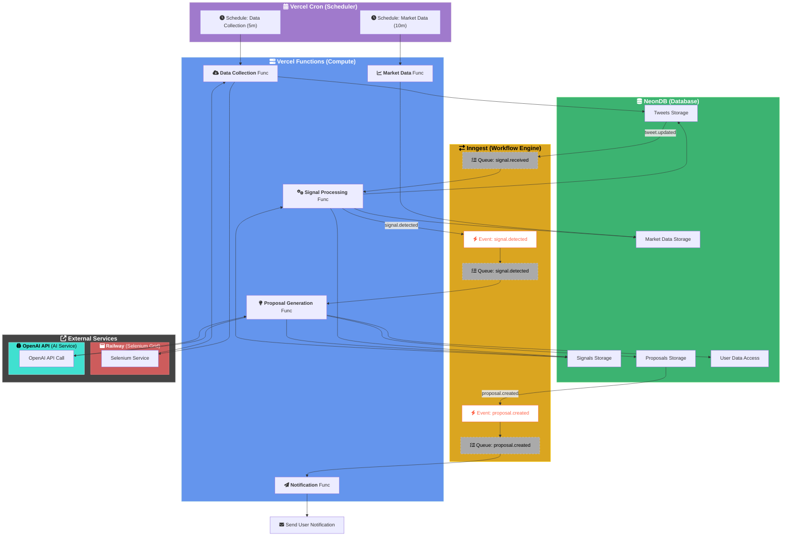

# バックエンド仕様書

## Data collection - Proposal Generation Flow

```mermaid
graph TD
    %% --- Runtimes Definition ---
    subgraph VercelCron ["<strong><big>fa:fa-calendar-alt Vercel Cron (Scheduler)</big></strong>"]
        A_Cron["fa:fa-clock Schedule: Data Collection (5m)"]
        Z_Cron["fa:fa-clock Schedule: Market Data (10m)"]
    end

    subgraph VercelFunctions ["<strong><big>fa:fa-server Vercel Functions (Compute)</big></strong>"]
        B_DataCollectionFunc["fa:fa-cloud-download-alt <strong>Data Collection</strong> Func"]
        Y_MarketDataFunc["fa:fa-chart-line <strong>Market Data</strong> Func"]
        H_SignalProcessingFunc["fa:fa-cogs <strong>Signal Processing</strong> Func"]
        Q_ProposalGenerationFunc["fa:fa-lightbulb <strong>Proposal Generation</strong> Func"]
        X1_NotificationFunc["fa:fa-paper-plane <strong>Notification</strong> Func"]
    end

    subgraph Inngest ["<strong><big>fa:fa-exchange-alt Inngest (Workflow Engine)</big></strong>"]
        ING_SignalQueue["fa:fa-tasks Queue: signal.received"]
        ING_ProposalQueue["fa:fa-tasks Queue: signal.detected"]
        ING_NotifyQueue["fa:fa-tasks Queue: proposal.created"]
        ING_SignalEvent["fa:fa-bolt Event: signal.detected"]
        ING_ProposalEvent["fa:fa-bolt Event: proposal.created"]
    end

    subgraph NeonDB ["<strong><big>fa:fa-database NeonDB (Database)</big></strong>"]
        DB_Tweets["Tweets Storage"]
        DB_MarketData["Market Data Storage"]
        DB_Signals["Signals Storage"]
        DB_Proposals["Proposals Storage"]
        DB_UserData["User Data Access"]
    end

    subgraph ExternalServices ["<strong><big>fa:fa-external-link-alt External Services</big></strong>"]
        subgraph Railway ["<strong>fa:fa-window-maximize Railway</strong> (Selenium Grid)"]
            C_Selenium["Selenium Service"]
        end
        subgraph OpenAI ["<strong>fa:fa-brain OpenAI API</strong> (AI Service)"]
            S_OpenAICall["OpenAI API Call"]
        end
    end

    %% --- Flows ---

    %% Data Collection Flow
    A_Cron --> B_DataCollectionFunc
    B_DataCollectionFunc --> C_Selenium
    C_Selenium --> B_DataCollectionFunc
    %% Assuming func coordinates scraping
    B_DataCollectionFunc --> DB_Tweets
    DB_Tweets -- "tweet.updated" --> ING_SignalQueue

    %% Market Data Update Flow
    Z_Cron --> Y_MarketDataFunc
    Y_MarketDataFunc --> DB_MarketData

    %% Signal Detection Flow
    ING_SignalQueue --> H_SignalProcessingFunc
    H_SignalProcessingFunc --> DB_MarketData
    H_SignalProcessingFunc --> DB_Tweets
    H_SignalProcessingFunc --> DB_Signals
    DB_Signals --> H_SignalProcessingFunc
    H_SignalProcessingFunc -- "signal.detected" --> ING_SignalEvent
    ING_SignalEvent --> ING_ProposalQueue

    %% Proposal Generation Flow
    ING_ProposalQueue --> Q_ProposalGenerationFunc
    Q_ProposalGenerationFunc --> DB_Signals
    Q_ProposalGenerationFunc --> DB_UserData
    Q_ProposalGenerationFunc --> S_OpenAICall
    S_OpenAICall --> Q_ProposalGenerationFunc
    Q_ProposalGenerationFunc --> DB_Proposals
    DB_Proposals -- "proposal.created" --> ING_ProposalEvent

    %% Notification Flow
    ING_ProposalEvent --> ING_NotifyQueue
    ING_NotifyQueue --> X1_NotificationFunc
    X1_NotificationFunc --> SendNotify["fa:fa-envelope Send User Notification"]

    %% --- Styling (Dark Mode Friendly) ---
    classDef VercelCron fill:#A07ACC,stroke:#D8BFD8,color:#fff;
    classDef VercelFunctions fill:#6495ED,stroke:#ADD8E6,color:#fff;
    classDef Inngest fill:#DAA520,stroke:#FFD700,color:#000;
    classDef NeonDB fill:#3CB371,stroke:#90EE90,color:#fff;
    classDef ExternalServices fill:#444,stroke:#888,color:#fff;
    classDef Railway fill:#CD5C5C,stroke:#F08080,color:#fff;
    classDef OpenAI fill:#40E0D0,stroke:#AFEEEE,color:#000;
    classDef Queue fill:#aaa,stroke:#ccc,color:#000,stroke-dasharray: 5 5;
    classDef Event fill:#fff,stroke:#FF6347,color:#FF6347;

    class VercelCron VercelCron;
    class VercelFunctions VercelFunctions;
    class Inngest Inngest;
    class NeonDB NeonDB;
    class ExternalServices ExternalServices;
    class Railway Railway;
    class OpenAI OpenAI;
    class ING_SignalQueue,ING_ProposalQueue,ING_NotifyQueue Queue;
    class ING_SignalEvent,ING_ProposalEvent Event;
```
